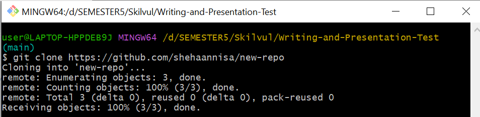

### Sheha Luthfi Annisa | Back-End Development

## **Asynchronus**

#### • Asynchronus

- Async await
  <br> Merupakan cara lain untuk menangkap objek promise. Fitur ini mempermudah kita dalam menangani proses asynchronous
  <br> Async/Await merupakan sebuah syntax khusus yang digunakan untuk menangani Promise agar penulisan code lebih efisien dan rapih. Contoh

```JavaScript
const getAllUser = async ()=> {
	const data = await getUser()
	console.log(data)
}
```

Contoh menjalankan code promise dengan menggunakan async Await :

```JavaScript
Let nonton = (kondisi) => {
Return new Promise((resolve, reject) => {
If (kondisi == “jalan”) {
Resolve(“nonton terpenuhi”)
} reject(“batal nonton”)
})
}

Async function asyncNonton() {
Try {
Let result = await nonton()
Console.log(result);
} catch (error) {
Console.log(“error”)
}
}
asyncNonton ()
```

• Error Handling
<br>Untuk menghandle error Async/Await kita dapat menggunakan try catch di dalam function yang kita buat, sehingga jika terjadi error kita dapat menangkap errornya dalam block catch.

```JavaScript
const getAllUser = async ()=> {
	try {
		const result = await getUser()
		console.log(result)
	} catch (error) {
		console.log(error)
	}
}
```

- Fetch
  <br> Fetch gunakan untuk mengambil data dan menampilkan data ke browser. Berfungsi untuk web dinamis yang datanya selalu berubah. Berikut merupakan ilustrasi mengenai fetch data api  
   <br>

• Mengambil data API menggunakan fetch

```JavaScript
fetch("https://digimon-api.vercel.app/api/digimon")
.then(result => result.json())
.then(result => {
  console.log(result)
})
```

• Menampilkan data API dalam web

```JavaScript
listDigimon = document.getElementById("list-digimon")

let getDataDigimon = async () => {
  let URL = "https://digimon-api.vercel.app/api/digimon"
  let response = await fetch(URL)
  let digimons = await response.json()

  // menampilkan 10 data digimon
  digimons.slice(0, 10).forEach((item, index) => {
      listDigimon.innerHTML +=
      `<div>
        
        <h3>${item.name}</h3>
      </div>`
  })
}

getDataDigimon()
```

## **Git dan GitHub**

### Git dan Github

    > Git dan GitHub adalah salah satu tool yang wajib digunakan dalam proyek pengembangan software. Git dan juga GitHub adalah Pengontrol versi bertugas mencatat setiap perubahan pada file proyek yang dikerjakan oleh banyak orang maupun sendiri. Git dan GitHub juga git digunakan untuk kolaborasi. Oleh karena itu Git dan Github sangat penting untuk Programmer.

### Perbedaan antara Git dan Github

- Git
  > Git merupakan software berbasis Version Control System (VCS) yang bertugas untuk mencatat perubahan seluruh file atau repository suatu project.
- GitHub
  > GitHub merupakan layanan cloud yang berguna untuk menyimpan dan mengelola sebuah project yang dinamakan repository (repo git). Cara kerja pada GitHub harus terkoneksi pada internet sehingga tidak perlu meng-install sebuah software ke dalam perangkat keras.
  > <br>Berikut Perbedaan Git dan GitHub
- Git :
  <br>1. Meng-install software di penyimpanan lokal
  <br>2. Dikelola oleh The Linux Foundation
  <br>3. Berfokus pada version control dan code sharing
  <br>4. Akses secara offline
  <br>5. Tidak menggunakan fitur user management
  <br>6. Menyediakan desktop interface bernama “Git GUI”
  <br>7. Open sourced licensed
- GitHub :
  <br>1. Host melalui layanan cloud
  <br>2. Diakuisisi oleh Microsoft pada 2018
  <br>3. Berfokus pada source code hosting terpusat
  <br>4. Akses secara online
  <br>5. Menggunakan user management
  <br>6. Menggunakan nama desktop interface “GitHub Desktop”
  <br>7. Pilihan bagi pengguna gratis dan pengguna berbayar

### Membuat Repository Git

1. Buat folder di laptop/komputer
   <br>
2. masuk ke folder tersebut, kemudian klik kanan pilih "Git Bash Here"
   <br>
3. ketikan git init. Sekarang folder yang dibuat tadi sudahh menjadi repository
   <br>

### Melakukan commit pada Git

1. Buat satu atau dua file
   <br>
2. Ketikkan "git add ." untuk melacak perubahan
   <br>
3. Kemudian baru ketikkan "git commit -m "(pesan perubahan)" untuk melakukan commit
   <br>

### Merge pada Git

1. User membuat repository baru.
   <br>
2. melakukan cloning ke local computer/laptop
   <br>
3. User membuat branch baru kemudian masuk ke branch tersebut dengan command `git branch nama_branch` kemudian `git checkout nama_branch`
   <br>
4. User melakukan pull branch main ke branch user, dengan command `git pull origin nama_branch_user`
   <br>
5. User membuat file baru
   <br>
6. User melakukan push ke branch user, dengan command `git push origin nama_branch_user`. Sebelum melakukan push pastikan sudah melakukan add dan juga commit.
   <br>
7. Buka Github, kemudian user melakukan pull request ke branch main.
   <br>
8. Kemudian lakukan merge pull request agar file dari branch user bisa berada di branch main.
   <br>

### Mempublish aplikasi ke Github

1. Membuat repository di github
2. Ketikkan "git remote add origin https://github.com/(username)/(repository yang dibuat).git" Untuk me-remote ke github
3. Ketikkan "git push -u origin (branch yang dipakai)"
4. Selesai. File sudah ada di Github

### Melakukan cloning Github ke local

1. buka repository yang ikin di cloning, kemudian klik code dan salin kode tersebut
2. Tentukan penyimpanan lokal, kemudian klik kanan dan pilih "Git Bash Here"
3. File yang ada di GitHub sudah selasai di cloning ke local

### Github Kolaborasi

Kita meisalkan ada user A dan user B, dan user A sebagai ketuanya.

1. User A membuat repository baru, kemudian menambahkan user B untuk collaborator dengan cara pergi ke settings > collaborators > tambahkan teman
2. User A dan user B membuat branch masing-masing, dengan command `git branch nama_branch`, kemudian masing-masing user pindah ke branch baru yang dibikin dengan command `git checkout nama_branch`
3. User A dan user B melakukan pull masing ke dalam branch masing-masing di local computer/laptop, dengan command `git pull origin main`
4. Misalkan user A ingin menambahkan file, maka user A membuat file terlebih dahulu, kemudian di push di branch user A, dengan command `git push origin nama_branch`
5. User kemudian user A melakukan pull request dan merge ke branch main, dengan cara yang sudah dijelaskan di materi sebelumnya.
6. Jika user B igin menambahkan file, maka user harus melakukan pull request kembali, agar nanti tidak ada error atau kesalahan.
7. Kemudian user B bisa melakukan push ke dalam branch nya.
8. User B kemudian melakukan pull request.
9. User B tidak perlu melakukan merge, dan yang melakukan merge adalah user A karena dia adalah pemimpinnya.
10. Ulangi dari langkah ke-4.

## **Responsive Web Design**

#### • Responsive Web Design

<br> Memungkinkan website dapat diakses dimanapun (device apapun), tampilannya tetap bagus dan enak dilihat

#### • Tools untuk membuat website yang responsif

1. Menggunakan viewport
   <br> Viewport : area website yang dapat diakses oleh user

- Setting viewport : Otomatis keluar saat menggunakan html dengan cara ketikan ! kemudian enter. Atau

```javascript
<meta name="viewport">
```

2. Menggunakan Max-Width element

- misalnya menjadikan gambar lebih responsif

```javascript

```

3. Menggunakan CSS relative unit

- relative length : em, rem, vw, vh, % (yg sering dipakai)
  - em : mengikuti ukuran huruf dari element dia berada. Nyari font size dengan parent element terdekat. Contoh : container dengan em nya
  - rem : mengikuti ukuran huruf dari root element (ukuran huruf html). Biasanya ukuran default html adalah 16px. Jadi 2rem = 2 x 16px = 32px
  - % : bergantung pada parent element
  - Vw : relatife 1% dengan lebar viewport.. 50vw = 50% dari lebar viewport
  - Vh : relatife 1% dengan tinggi viewport. 50vh = 50% dari tinggi viewport

4. Menggunakan media query
   <br> Membuat beberapa style bergantung pada jenis device
   <br> Kata kunci : @media. Contoh :

```javascript
@media (max-width: 500px) {
}
```

<br> Keterangan : Jika ukuran layar dibawah 500px maka style settingan didalam @media yang berlaku

5. Menggunakan Flexbox dan Grid

- Flexbox
  <br> Satu arah entah samping(kanan-kiri) atau atas bawah
- Grid
  <br> Bisa kearah samping dan atas bawah

## **Bootstrap 5**

- Kapan menggunakan bootstrap?
  <br> ketika kita ingin membuat website kita menjadi responsif dengan cara yang simple karena sudah ada templatenya dan tinggal dicopy paste untuk digunakan
- Layout pada bootstrap

1. Breakpoint : sebagai acuan untuk menyesuaikan tampilan dalam berbagai ukuran viewport. Beberapa breakpoint pada bootstrap 5 sm, md, lg, xl, xxl
2. Containers : layout basicnya bootstarp
   - Default Container
     <br> Class container memiliki sifat yang responsive dan fixed-width, yang berarti lebarnya akan berubah pada setiap breakpoint
     ```javascript
     <div class="container">
     <!-- Content here -->
     </div>
     ```
   - Fluid Container
     <br> Class container-fluid memiliki lebar yang sama dengan viewport
     ```html
     <div class="container-fluid">
       <!-- Content here -->
     </div>
     ```
   - Responsive Container
     ```html
     <div class="container-sm">100% wide until small breakpoint</div>
     <div class="container-md">100% wide until medium breakpoint</div>
     <div class="container-lg">100% wide until large breakpoint</div>
     <div class="container-xl">100% wide until extra large breakpoint</div>
     <div class="container-xxl">100% wide until extra extra large breakpoint</div>
     ```
3. Grid : menyediakan 12 kolom system
   <br> Grid system membagi lebar halaman menjadi 12 bagian. Sehingga apabila menggunakan class col-8, maka lebarnya akan menjadi 8/12 atau 2/3 dari lebar halaman.
4. Columns
   <br> mengatur urutan posisi dan align

- Component pada bootstrap
  <br> beberapa component pada bootstrap 5
  - Alerts
  - Breadcrumb
  - Buttons
  - Card
  - Modal
  - Navbar
  - Navs & tabs
  - Pagination
- Content pada bootstrap
  - Reboot
  - Typography
  - Images
  - Tables
  - Figures

##### Untuk selengkapnya bisa belajar disini : link bootstrap https://getbootstrap.com/
