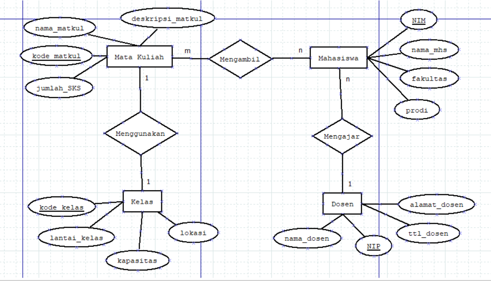

## Design Database with MySQL
### Entity / Entitas
>adalah kumpulan objek yang dapat diidetifikasikan secara unik atau berbeda. Biasanya simbol dari entitas adalah persegi panjang
### Atribut
>berfungsi untuk mendeskripsikan karakteristik dari entitas tersebut. Simbol dari atribut adalah elips
### Membuat Design Database
1. Menggunakan website/aplikasi pembuat diagram, contohnya : aplikasi atau website draw.io

>Penjelasan :
