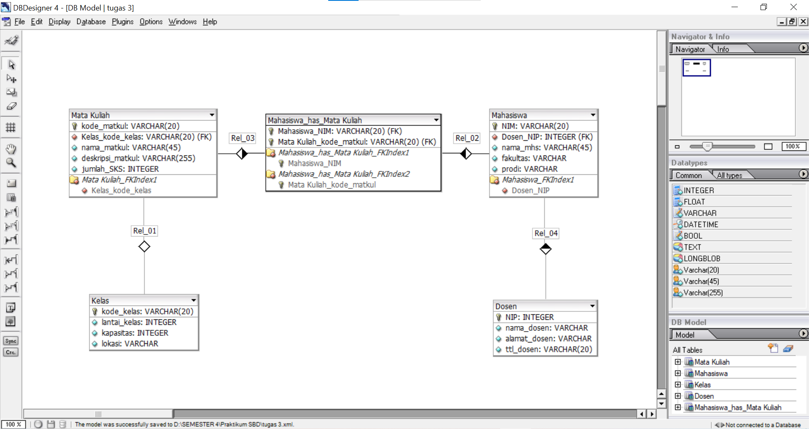

## Design Database with MySQL
### Entity / Entitas
>adalah kumpulan objek yang dapat diidetifikasikan secara unik atau berbeda. Biasanya simbol dari entitas adalah persegi panjang
### Atribut
>berfungsi untuk mendeskripsikan karakteristik dari entitas tersebut. Simbol dari atribut adalah elips
### Relasi
>adalah hubungan antara entitas
### Membuat Design Database
1. Menggunakan website/aplikasi pembuat diagram, contohnya : aplikasi atau website draw.io
 
>Penjelasan :
- Ada 4 entitas yaitu : Kelas, Mata Kuliah, Mahasiswa, dan Dosen
- Relasi : 
  - 1 kelas dapat digunakan oleh 1 mata kuliah -> relasinya adalah one to one
  - 1 dosen dapat mengajar banyak/beberapa mahasiswa -> relasinya adalah one to many
  - 1 mahasiswa dapat mengambil beberapa mata kuliah | 1 mata kuliah dapat diambil oleh beberapa mahasiswa -> relasinya adalah many to many
- Atribut :
  - Entitas kelas memiliki 4 atribut : kode_kelas(sebagai primary key), lantai_kelas, kapasitas, dan lokasi
  - Entitas mata kuliah memiliki 4 atribut : kode_matkul (primary key), jumlah_SKS, nama_matkul, dan deskripsi_matkul
  - Entitas mahasiswa memiliki 4 atribut : NIM (primary key), nama_mhs, fakultas, dan prodi
  - Entitas dosen memiliki 4 atribut : NIP (primary key), nama_dosen, alamat_dosen, dan ttl_dosen
  >Primary key adalah sesuatu yang isinya tidak akan sama dengan yang lain. Contohnya NIM mahasiswa satu dengan mahasiswa lain tidak sama, pasti berbeda-beda
2. Relationship/Relasi Entity Keseluruhan
 
